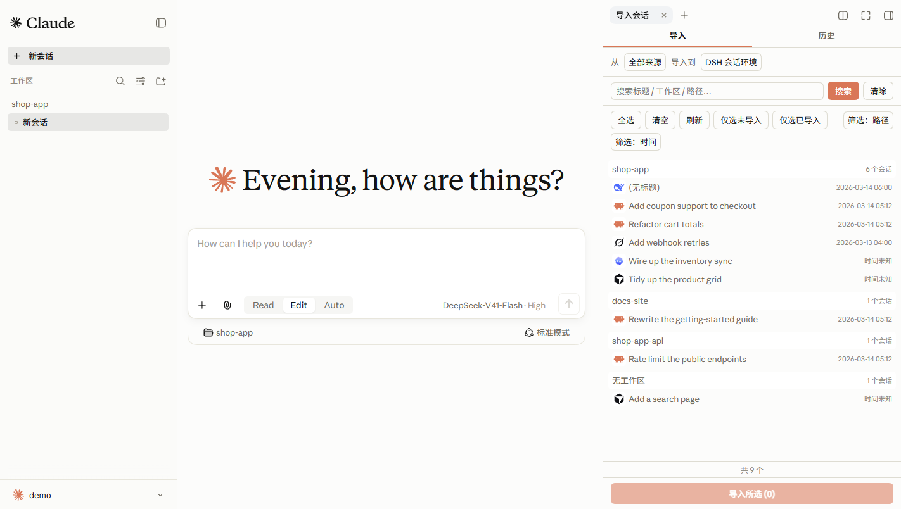
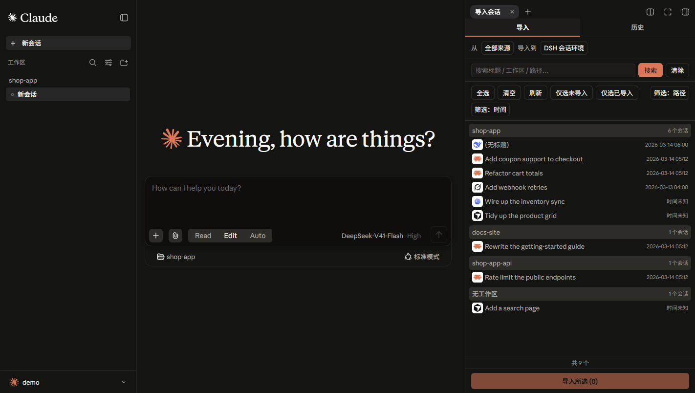

<div align="center">


# DSH Chat Import

**A session import plugin built on DeepSeek Harness: import conversation history from external agents with one click and continue chatting in DeepSeek Harness.**

> **All sessions, continued in DSH.**

[](README.md) [](README.zh-CN.md)

[](https://www.npmjs.com/package/dsh-chat-import)
[](https://www.npmjs.com/package/dsh-chat-import)
[](https://github.com/Nwflower/dsh-chat-import)
[](https://gitcode.com/Nwflower/dsh-chat-import)
[](LICENSE)
[](https://awesome-dsh-plugin.com)
[](https://www.dsh.so/artifact/dsh-chat-import/)

</div>


## Supported Data Sources

<table>
  <tr>
    <td align="center" width="20%"><a href="https://github.com/anthropics/claude-code"><br /><b>Claude Code</b></a></td>
    <td align="center" width="20%"><a href="https://github.com/openai/codex"><br /><b>Codex</b></a></td>
    <td align="center" width="20%"><a href="https://github.com/google-gemini/gemini-cli"><br /><b>Gemini CLI</b></a></td>
    <td align="center" width="20%"><a href="https://github.com/aaif-goose/goose"><br /><b>Goose</b></a></td>
    <td align="center" width="20%"><a href="https://github.com/charmbracelet/crush"><br /><b>Crush</b></a></td>
  </tr>
  <tr>
    <td align="center" width="20%"><a href="https://github.com/qoderAI/qoder-cli"><br /><b>Qoder CLI</b></a></td>
    <td align="center" width="20%"><a href="https://github.com/MoonshotAI/kimi-cli"><br /><b>Kimi CLI</b></a></td>
    <td align="center" width="20%"><a href="https://github.com/MoonshotAI/kimi-code"><br /><b>Kimi Code</b></a></td>
    <td align="center" width="20%"><a href="https://github.com/esengine/DeepSeek-Reasonix"><br /><b>Reasonix</b></a></td>
    <td align="center" width="20%"><a href="https://github.com/anomalyco/opencode"><br /><b>OpenCode</b></a></td>
  </tr>
  <tr>
    <td align="center" width="20%"><a href="https://github.com/XiaomiMiMo/MiMo-Code"><br /><b>MiMo Code</b></a></td>
    <td align="center" width="20%"><a href="https://z.ai"><br /><b>ZCode</b></a></td>
    <td align="center" width="20%"><a href="https://github.com/xai-org/grok-build"><br /><b>Grok Build</b></a></td>
    <td align="center" width="20%"><a href="https://github.com/openclaw/openclaw"><br /><b>OpenClaw</b></a></td>
    <td align="center" width="20%"><a href="https://github.com/Kilo-Org/kilocode"><br /><b>Kilo Code</b></a></td>
  </tr>
  <tr>
    <td align="center" width="20%"><a href="https://github.com/badlogic/pi-mono"><br /><b>Pi Coding Agent</b></a></td>
    <td align="center" width="20%"><a href="https://github.com/NousResearch/hermes-agent"><br /><b>Hermes</b></a></td>
    <td align="center" width="20%"><a href="https://cursor.com"><br /><b>Cursor</b></a></td>
    <td align="center" width="20%"><a href="https://github.com/cline/cline"><br /><b>Cline</b></a></td>
    <td align="center" width="20%"><a href="https://github.com/continuedev/continue"><br /><b>Continue</b></a></td>
  </tr>
  <tr>
    <td align="center" width="20%"><a href="https://github.com/zed-industries/zed"><br /><b>Zed</b></a></td>
    <td align="center" width="20%"><a href="https://antigravity.google"><br /><b>Antigravity</b></a></td>
    <td align="center" width="20%"><a href="https://chatgpt.com"><br /><b>ChatGPT</b></a></td>
    <td align="center" width="20%"><a href="https://github.com/gabotechs/workbuddy"><br /><b>WorkBuddy</b></a></td>
    <td align="center" width="20%"><a href="https://github.com/QwenLM/qwen-code"><br /><b>Qwen</b></a></td>
  </tr>
  <tr>
    <td align="center" width="20%"><a href="https://github.com/deepseek-ai/deepseek-harness"><br /><b>DSH</b></a></td>
    <td align="center" width="20%"><a href="https://www.teleai.com.cn/product/super-agent"><br /><b>TeleAgent</b></a></td>
    <td align="center" width="20%"><a href="#usage"><br /><b>Local JSONL</b></a></td>
    <td align="center" width="20%"></td>
    <td align="center" width="20%"></td>
  </tr>
</table>

## Install

> Requires dsh ≥ 0.1.5-rc.1

1. Install via terminal

```bash
dsh plugin --profile web add dsh-chat-import                    # npm package
```

2. Install via [Plugin Marketplace](https://github.com/dsh-market/dsh-market)

## Usage

1. Import conversations via GUI
  Open the import window from the "Import sessions" button at the bottom of the left sidebar, select the conversations you want to import, and import with one click.

  <table>
    <tr>
      <td align="center" width="50%"></td>
      <td align="center" width="50%"></td>
    </tr>
  </table>

  > These screenshots also use the author's other theme plugin, [DSH Claude Style](https://github.com/Nwflower/dsh-claude-style): it recreates the look and feel of Claude Code Desktop inside DSH. If the default theme is not quite your taste, give it a try.

2. Import via Agent tool calls

```
# Example call formats
import_chat({ format: "claude", path: "~/.claude/projects" })
import_chat({ format: "chatgpt", path: "~/Downloads/chatgpt-export/conversations.json" })
import_chat({ format: "local-jsonl", path: "D:\downloads\session.jsonl" })
```

## Configuration

For TUI compatibility, plugin-provided tools are injected into context by default. You can configure the import tools in Settings to **not inject into context** or inject partially, which saves a significant amount of tokens.

For full tool / command usage, see **[docs/USAGE.md](docs/USAGE.md)**.

## Features

| Capability | Entry Point | Description |
| --- | --- | --- |
| Import | Sidebar panel "Import" tab | Import conversations from other agents, preserving reasoning, tool call results, and system prompts (optional) |
| Retract Import | Sidebar panel "History" tab | View import history and delete sessions created by this plugin with one click |
| Export | Context tool | Serialize DSH sessions back to external agents |
| Sync | Sidebar panel "Sync" tab | Bidirectional incremental sync between external agents and DSH, off by default |
| Ignore | Automatic + `/ignores` commands | Archive / delete / workspace-removal auto-registers the source so rescans and sync skip it; `/ignore`, `/unignore` manage the table |

## Docs

| Document | Description |
| --- | --- |
| [Usage Reference](docs/USAGE.md) | Full parameters, examples, and edge cases for every tool / command |
| [Interchange Protocol](docs/INTERCHANGE.md) | Interchange v1 protocol and bundle format |
| [Settings Migration](docs/SETTINGS-MIGRATION.md) | DSH 0.1.5 → 0.1.7 plugin settings-page migration (measured errors, compatibility recipe) |
| [Changelog](CHANGELOG.md) | Version history |
| [Roadmap](docs/ROADMAP.md) | Shipped / planned |
| [Contributing](docs/CONTRIBUTING.md) | Development setup, commit rules, security & privacy |

## Related Links

> Only need to migrate **configuration** (skills, hooks, global settings, etc.) rather than conversation history? Recommended: [dsh-movein](https://github.com/sjh9714/dsh-movein)

## Star History

[](https://www.star-history.com/?type=date&repos=Nwflower%2Fdsh-chat-import)
